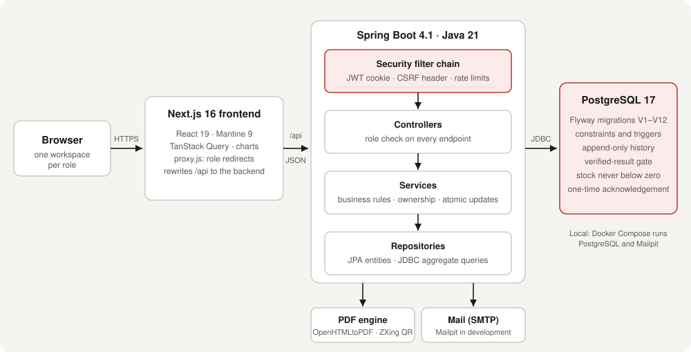
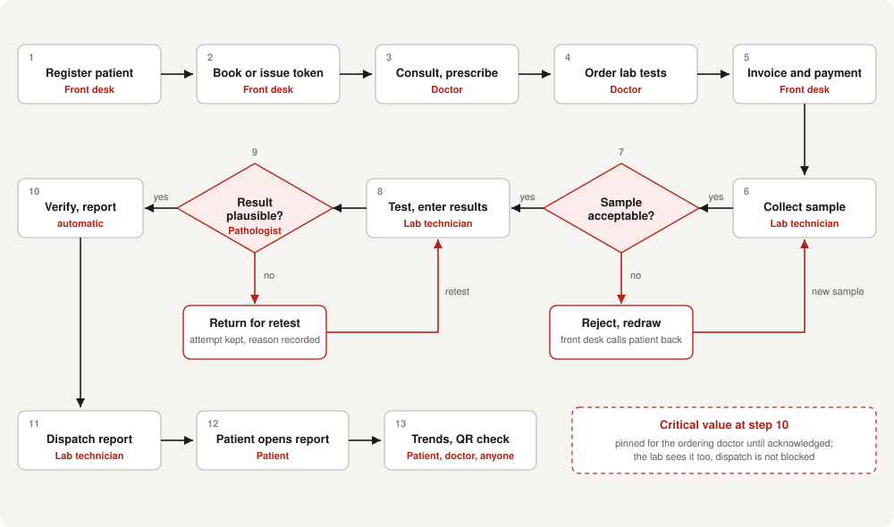
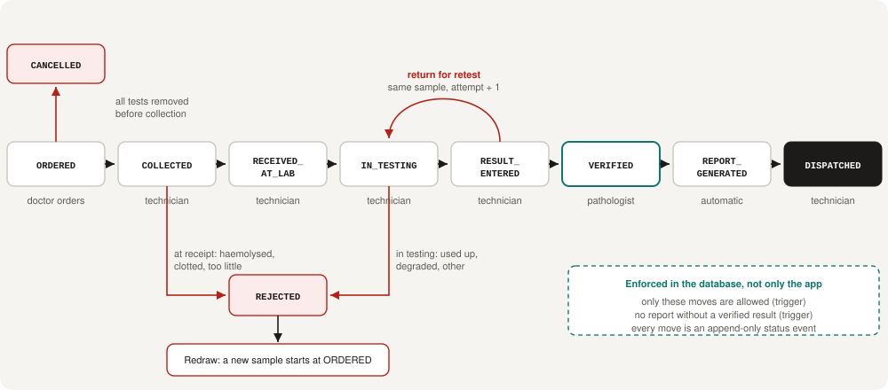
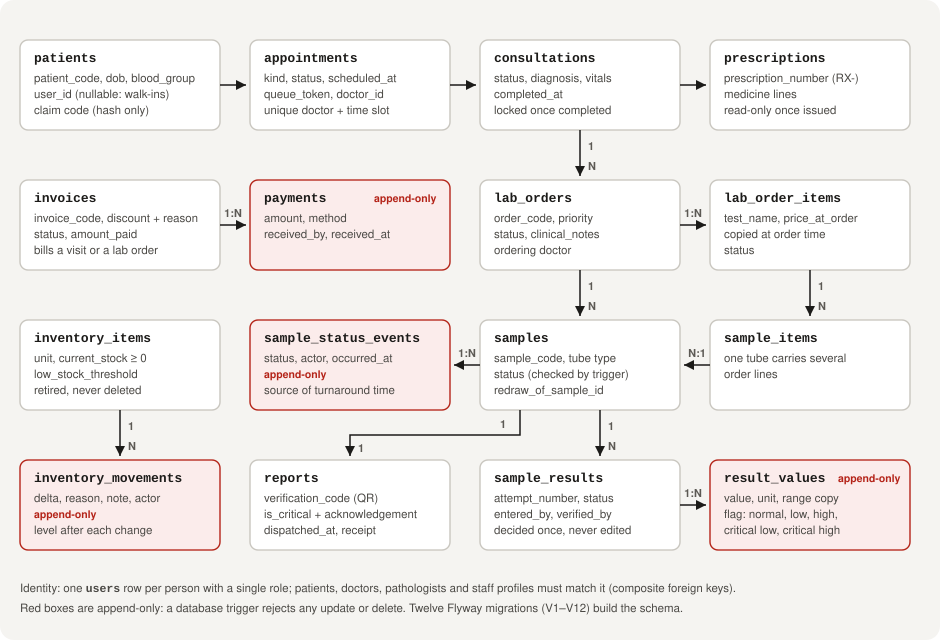
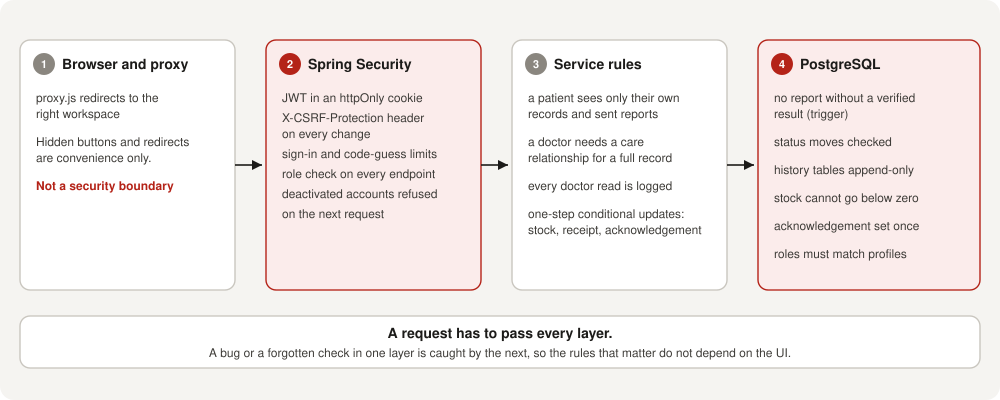

# Clinic and Diagnostic Lab Management System (CDLMS)

A web application that runs a clinic and its diagnostic laboratory as one system: from registering a patient and the doctor's consultation, through sample collection and testing, to a **pathologist-verified lab report** delivered to the patient, and the bill that goes with it.

| | |
|---|---|
| **Status** | All 10 planned phases implemented (see [Tracker](Docs/Tracker.md)) |
| **Users** | 6 roles: patient, doctor, pathologist, receptionist, lab technician, admin |
| **Backend** | Java 21, Spring Boot 4.1, Spring Security (JWT), JPA, Flyway |
| **Frontend** | Next.js 16 (App Router), React 19, Mantine 9, TanStack Query (JavaScript) |
| **Database** | PostgreSQL 17, 12 migrations |
| **Tests** | 259 backend (JUnit, MockMvc, Testcontainers) and 119 frontend (Vitest), all passing |

## 1. Problem and scope

In a small clinic with its own lab, patient details, lab orders, sample handling and billing usually live in separate places. That leads to three concrete failures this project addresses:

1. **Results released without clinical sign-off.** A report cannot exist here until a pathologist has verified the result, and the database enforces it.
2. **No chain of custody for samples.** Every sample step is recorded with who and when, and cannot be edited afterwards. Rejected samples are kept and redrawn as new samples.
3. **Patient data visible to the wrong people.** Access is limited per role and per patient, and every doctor's read of a patient record is logged.

Out of scope by design: native apps, insurance claims, multi-branch tenancy, online payment gateways, telemedicine ([NonGoals](Docs/NonGoals.md)).

## 2. Features

| Module | What it does |
|---|---|
| Registration and records | Front desk registers patients (with a one-time code to link a login); medical record with allergies, blood group and history |
| Appointments and queue | Booking by slot, walk-in tokens, a live queue board per doctor, reminder emails |
| Consultations | Notes, vitals, prescription builder, prescription PDF; locked once completed |
| Lab catalog and orders | Tests with tube type, patient preparation, normal and critical ranges; ordered from a consultation or directly |
| Sample lifecycle | Collect, receipt check, reject and redraw, testing; printable QR label; full status history |
| Results and verification | Server-side range flags, pathologist verify or return for retest, attempts kept |
| Reports | PDF with the pathologist's stamp and a **QR code** anyone can scan to confirm it is genuine; email or download dispatch |
| Critical value alerts | The ordering doctor sees a pinned alert until they acknowledge it (who and when recorded) |
| Trends | The same test across visits, drawn with its normal range |
| Billing | Invoice per visit or lab order, part payments, logged discounts with a front-desk cap |
| Inventory | Stock with low-stock warnings; every change is a recorded movement |
| Admin insights | Revenue, patients, most-ordered tests, staff activity and turnaround time by test |
| Staff accounts | Admin adds and deactivates accounts; one-time temporary password |

## 3. Architecture



The browser only talks to the Next.js app, which forwards `/api` to Spring Boot. Authentication is a JWT in an `httpOnly` cookie, and every change carries an `X-CSRF-Protection` header. Decisions and their reasons are recorded as 32 ADRs in [Decisions](Docs/Decisions.md).

## 4. Workflow

### Patient journey



### Sample lifecycle



Only the moves shown are allowed. The database rejects any other move, and refuses to create a report for a sample without a verified result.

## 5. Data model



Full column-level description: [Schema](Docs/Schema.md).

## 6. Security and data integrity



| Role | Can | Cannot |
|---|---|---|
| Patient | See own record, appointments, prescriptions, bills, trends, and reports once sent | See anyone else's data |
| Doctor | Search patients; open the full record with a care relationship; consult, prescribe, order tests; acknowledge critical results | Open a record without an appointment or token; verify results |
| Pathologist | Verify or return results; see the patient's lab history | Verify a result they entered themselves; see billing |
| Receptionist | Register, book, queue, bill and take payments | See lab results or prescriptions |
| Lab technician | Collect, receive, reject, test, enter results, dispatch reports, record stock use | Verify results; see billing |
| Admin | Insights, staff accounts, inventory setup, invoices and larger discounts | Write prescriptions or verify results |

Details: [Security](Docs/Security.md) and [Rules](Docs/Rules.md). Highlights:

- Passwords are hashed (BCrypt); sign-in and registration-code guessing are rate-limited.
- Public endpoints: sign-in, registration, and the report authenticity check, which returns no results.
- API documentation is off unless explicitly enabled.

## 7. Testing

| Suite | Count | Covers |
|---|---|---|
| Backend integration and unit | 259 | Role access, CSRF, every workflow through the API, database triggers and constraints, concurrency (stock, acknowledgements, report receipt), PDFs |
| Frontend | 119 | Validation and formatting logic, range flags, charts helpers, status components |

Integration tests run against a real PostgreSQL started by Testcontainers, so they use the real migrations. The end-to-end rehearsal is `scripts/demo-walkthrough.mjs`, which signs in as every role and drives the full journey through the API, stopping at the first failing step. The plan and priority cases are in [TestPlan](Docs/TestPlan.md).

```bash
cd backend && ./mvnw test        # needs Docker running
cd frontend && npm test          # unit tests
cd frontend && npm run lint
```

## 8. Run locally

Requirements: JDK 21, Node 20+, Docker Desktop. Maven is bundled (`mvnw`).

```bash
docker compose up -d                                  # PostgreSQL and Mailpit (mail inbox at :8025)

cd backend
./mvnw spring-boot:run -Dspring-boot.run.profiles=dev # http://localhost:8080, loads demo accounts

cd frontend                                           # in a second terminal
npm install
npm run dev                                           # http://localhost:3000
```

Optional: fill the database with a realistic demo (about a minute, local only, resumable):

```bash
node scripts/demo-walkthrough.mjs
```

Demo accounts (development profile only), password `Demo@12345`:

| Role | Email |
|---|---|
| Patient | `patient@demo.cdlms.dev` |
| Doctor | `doctor@demo.cdlms.dev` |
| Pathologist | `pathologist@demo.cdlms.dev` |
| Receptionist | `reception@demo.cdlms.dev` |
| Lab technician | `lab@demo.cdlms.dev` |
| Admin | `admin@demo.cdlms.dev` |

Environment variables and Windows notes: [Setup](Docs/Setup.md).

## 9. Repository layout

```
backend/    Spring Boot application (com.cdlms.*: auth, patient, appointment, consultation, lab,
            sample, result, billing, inventory, analytics, staff, dashboard) and Flyway migrations
frontend/   Next.js application (app/ routes per role, components/, lib/ data hooks and helpers)
Docs/       Product, design, schema, API, rules, security, decisions, test plan, diagrams
phases/     The ten build phases, each with scope and exit criteria
scripts/    demo-walkthrough.mjs (end-to-end run and demo data)
```

## 10. Documentation

| Document | Contents |
|---|---|
| [PRD](Docs/PRD.md), [Appflow](Docs/Appflow.md) | Requirements and user flows |
| [Design](Docs/Design.md) | Screens and visual system |
| [Schema](Docs/Schema.md), [API](Docs/API.md) | Tables and endpoints |
| [Rules](Docs/Rules.md), [Security](Docs/Security.md) | Business rules and protections |
| [Decisions](Docs/Decisions.md) | 32 architecture decision records |
| [TestPlan](Docs/TestPlan.md), [Tracker](Docs/Tracker.md), [Changelog](Docs/Changelog.md) | Testing, progress, what shipped |

## 11. Known limitations

- Runs on local PostgreSQL; the shared Supabase project and a deployment are not set up.
- No SMS: reports go by email or download link. No "forgot password" flow; a temporary password is not forced to change at first sign-in.
- No automatic stock use per test, and no escalation if a critical result stays unacknowledged.
- No automated browser (Playwright) tests; screens were verified manually in the browser.
- The pathologist's stamp prints name, qualification and registration number; a signature image is not supported.

Open items are tracked in [OpenQuestions](Docs/OpenQuestions.md).
